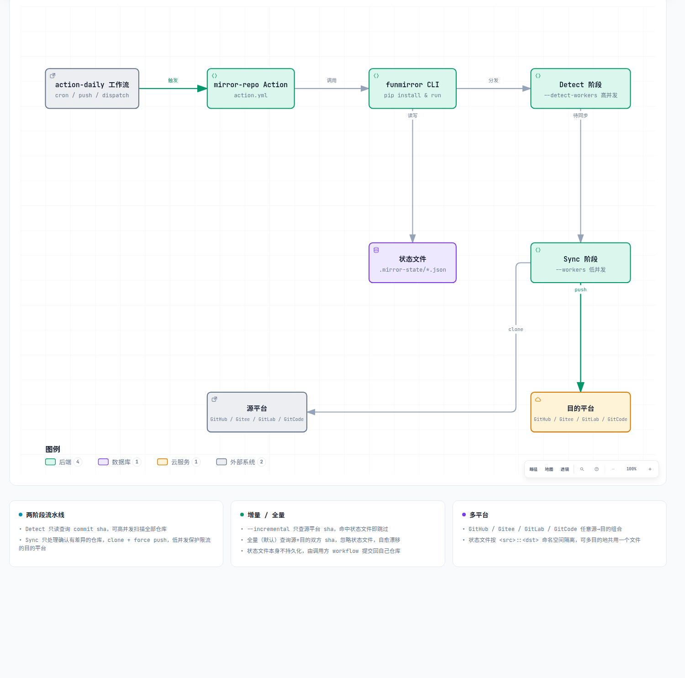

# funmirror

Mirror every repo from one hosting platform's organization to another's, in
parallel, skipping repos whose default branch hasn't changed since the last
run. Supports GitHub, Gitee, GitLab and GitCode as either source or
destination.

Built for [`farfarfun-action/mirror-repo`](https://github.com/farfarfun-action/mirror-repo),
which is a thin wrapper around this package's CLI. It reproduces the core
behavior of [`Yikun/hub-mirror-action`](https://github.com/Yikun/hub-mirror-action)
(clone from the source platform, force-push `refs/remotes/origin/*:refs/heads/*`
plus tags to the destination) without depending on that action, and adds two
things it doesn't have:

- **Two-phase parallelism** — a cheap, read-only *detect* phase (via a
  [`funworker`](https://github.com/farfarfun/funworker) pipeline,
  `--detect-workers`, default `max(workers*4, 16)`) checks every repo's
  commit id concurrently at high fan-out; only repos that actually differ
  move on to the heavier *sync* phase (`--workers`, default 8), which can be
  kept much lower to avoid overwhelming a rate-limited destination.
- **Skip-if-unchanged** — before cloning anything, the latest commit sha of
  the source and destination default branch is compared; if they already
  match, the repo is skipped entirely.

## Architecture



`action-daily` triggers `mirror-repo`, which installs and calls this CLI.
The CLI dispatches a high-concurrency detect phase, then a low-concurrency
sync phase against the source/destination platform; the state file is read
and rewritten locally on every run, and persisting it across CI runs is the
caller's job (see "Incremental sync via a state file" below).

## Install

```bash
pip install "git+https://github.com/farfarfun/funmirror.git@v0.4.0"
```

## Usage

```bash
funmirror mirror \
  --src-platform github --dst-platform gitee \
  --src-org my-org --dst-org my-org \
  --dst-token "$GITEE_TOKEN" \
  --dst-key-file ~/.ssh/gitee_deploy_key \
  --src-token "$GITHUB_TOKEN" \
  --repo-names repo-a,repo-b \
  --workers 8
```

`--src-platform`/`--dst-platform` are one of `github`, `gitee`, `gitlab`,
`gitcode`. `--src-key-file`/`--dst-key-file` (SSH key for push) are only
required when the corresponding platform is `gitee`. `--src-endpoint`/
`--dst-endpoint` are only used for self-hosted GitLab instances.
`--repo-names` is optional; if omitted, every repo in `--src-org` is
mirrored (requires `--src-token` to list them).

Exit code is `1` if any repo failed to mirror; a one-line summary
(`Mirrored X, skipped Y, failed Z (total N)`) is printed and, if
`GITHUB_STEP_SUMMARY` is set, appended to it.

## How a single repo is mirrored

Mirroring happens in two phases, run as two separate concurrent pipelines:

1. **Detect** (`--detect-workers`, high concurrency): for every repo, look up
   the latest commit sha of the source default branch (in `--incremental`
   mode) or of both the source and destination branch (in full-sync mode,
   see below). Decide whether the repo needs syncing.
2. **Sync** (`--workers`, low concurrency): only for repos the detect phase
   flagged as differing — create the destination repo if it doesn't exist
   yet, then `git clone` from the source and `git push` (force by default)
   `refs/remotes/origin/*:refs/heads/*` plus tags to the destination, with
   retries.

Keeping these as separate worker pools lets detection run fast and wide
(it's just read-only API calls) while the actual clone+push traffic against
a rate-limited/WAF'd destination like Gitee stays throttled.

## Incremental sync via a state file

`--state-file PATH` persists a JSON map across runs, namespaced by
`<src-platform>/<src-org>::<dst-platform>/<dst-org>` so multiple platform
pairs can safely share one file without their progress getting mixed up:

```json
{
  "github/my-org::gitee/my-org": {
    "repo-a": {"src_sha": "abc123", "dst_sha": "abc123"}
  }
}
```

`--incremental` and full sync (the default, no `--incremental`) query
different things during detection:

- **`--incremental`**: only the *source* platform's commit sha is queried,
  for every repo. If it matches the state file's `src_sha`, the repo is
  skipped **without ever querying the destination platform**. If it doesn't
  match (or there's no state entry yet), the repo goes straight to the sync
  phase — trusting that the destination was already in sync as of the last
  recorded `src_sha`, so there's no need to read it first either.
- **Full sync** (no `--incremental`): both the source *and* destination
  platform's commit shas are queried for every repo, ignoring the state file
  for the skip/sync decision entirely — only repos whose source and
  destination shas actually differ are synced. This is what self-heals any
  drift an incremental run might have left behind (e.g. someone pushing
  directly to the destination).

```bash
# hourly, cheap: only the src platform is queried; most repos short-circuit
# off local state without a single dst API call
funmirror mirror --src-platform github --dst-platform gitee \
  --src-org my-org --dst-org my-org --dst-token "$GITEE_TOKEN" \
  --dst-key-file ~/.ssh/gitee_deploy_key --state-file .mirror-state/gitee.json \
  --incremental

# daily, thorough: queries both src and dst for every repo and ignores the
# state file for the decision, then rewrites the state file from the
# confirmed results
funmirror mirror --src-platform github --dst-platform gitee \
  --src-org my-org --dst-org my-org --dst-token "$GITEE_TOKEN" \
  --dst-key-file ~/.ssh/gitee_deploy_key --state-file .mirror-state/gitee.json \
  --workers 2
```

A repo's state entry is only ever updated once its shas are *confirmed*
(either via a detect-phase match, or after a successful push) — a repo that
fails to sync leaves its previous state entry untouched, so it's retried for
real on the next run instead of being incorrectly marked up to date.
`funmirror` only reads/writes the file locally; persisting it across CI runs
(e.g. committing it back to a repo) is the caller's responsibility.

## Development

```bash
pip install -e ".[dev]"
pytest
```
